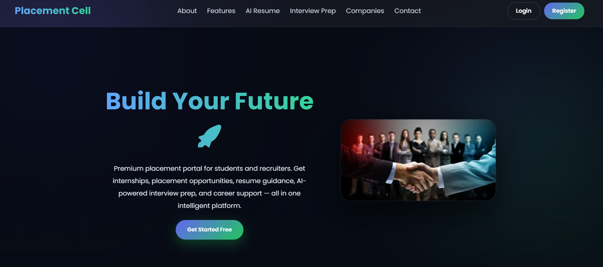
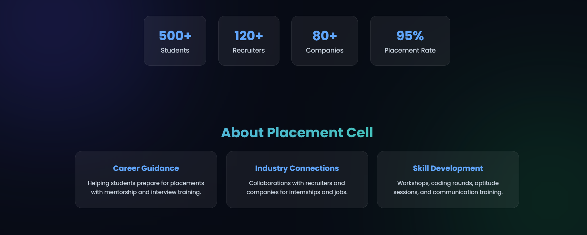
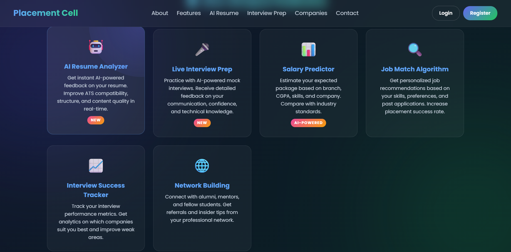
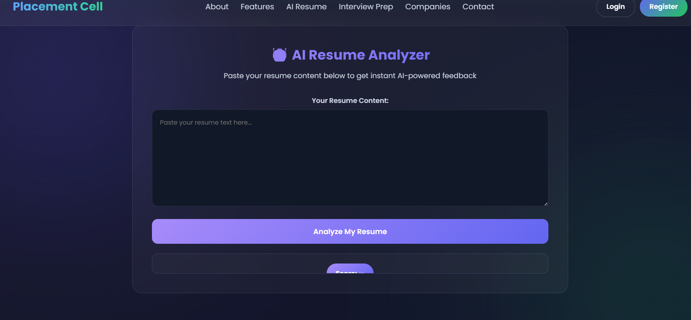
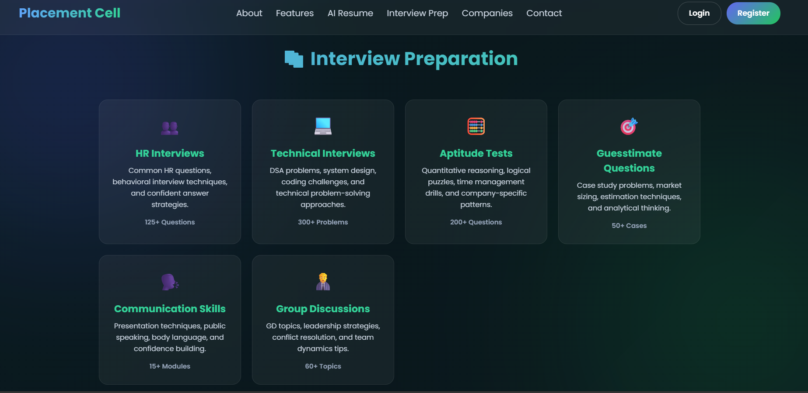
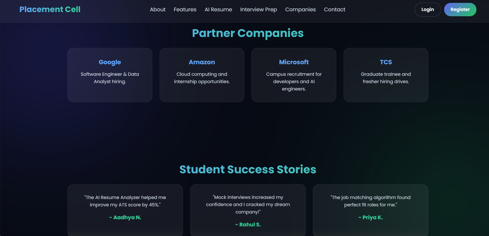

🎓 Placement Cell Website
A full-stack campus placement portal built with **Node.js, Express, and MySQL** — connecting students, recruiters, and companies on a single intelligent platform.

🚀 Live Demo
> _Add your deployed link here (Render / Railway / Vercel)_

📸 Screenshots

🏠 Homepage


📊 Platform Stats & About


⚙️ Features


🤖 AI Resume Analyzer


🎤 Interview Preparation


🏢 Partner Companies


📌 About the Project
Placement Cell is a premium placement management platform designed to streamline campus recruitment. It serves **500+ students**, **120+ recruiters**, and **80+ partner companies** with a reported **95% placement rate**.

The platform provides:
- Centralized job and internship opportunity management
- AI-powered resume analysis with ATS compatibility scoring
- Interview preparation modules across HR, Technical, Aptitude, and GD rounds
- Company drive tracking and student profile management

✨ Key Features

| Feature | Description |
| 🤖 AI Resume Analyzer | Paste resume content and get instant ATS compatibility feedback and scoring |
| 🎤 Live Interview Prep | Practice modules for HR interviews (125+ Qs), Technical (300+ problems), Aptitude (200+ Qs), GD (60+ topics) |
| 💰 Salary Predictor | Estimate expected package based on branch, CGPA, skills, and company benchmarks |
| 🎯 Job Match Algorithm | Personalized job recommendations based on skills and application history |
| 📈 Interview Success Tracker | Analytics on interview performance and company fit |
| 🌐 Network Building | Connect with alumni, mentors, and fellow students |
| 🏢 Partner Companies | Google, Amazon, Microsoft, TCS and more |

🛠️ Tech Stack

| Layer | Technology |
| Frontend | HTML5, CSS3, JavaScript |
| Backend | Node.js, Express.js |
| Database | MySQL |
| Authentication | Role-based access control (Student / Recruiter / Admin) |
| AI Feature | Resume text analysis with scoring engine |

📁 Project Structure
Placement-Cell-Website/
├── index.html          # Main frontend entry point
├── server.js           # Node.js + Express backend
├── package.json        # Dependencies
└── screenshots/        # Project screenshots
```

⚙️ Getting Started

### Prerequisites
- Node.js v16+
- MySQL 8.0+

### Installation

```bash
# Clone the repository
git clone https://github.com/Aadhyaaa26/Placement-Cell-Website.git

# Navigate into the project
cd Placement-Cell-Website

# Install dependencies
npm install
```

### Database Setup

```bash
# Create a MySQL database
mysql -u root -p
CREATE DATABASE placement_cell;
```

> Import the schema file: `mysql -u root -p placement_cell < schema.sql`

### Run the App

```bash
node server.js
```

Open your browser at `http://localhost:3000`

👤 User Roles

| Role | Access |
| **Student** | Register, view job drives, apply to companies, use AI Resume Analyzer and Interview Prep |
| **Recruiter** | Post job listings, view student profiles, manage applications |
| **Admin** | Full platform access — manage users, drives, companies, and placement records |

🙋‍♀️ Author

Aadhya Nadar
- GitHub: [@Aadhyaaa26](https://github.com/Aadhyaaa26)
- LinkedIn: [linkedin.com/in/aadhyanadar2605](https://linkedin.com/in/aadhyanadar2605)
- Email: aadhyanadar@gmail.com

📄 License
This project is open source and available under the [MIT License](LICENSE).
